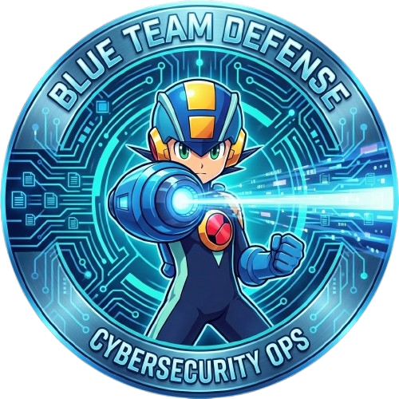

<p align="center">
  
</p>

# CyberDefense-Toolkit

A curated collection of blue team tools, defensive scripts, and resources for incident response, threat hunting, and security monitoring. Designed to enhance visibility and automate defensive operations.

[](LICENSE)
<!--[](CONTRIBUTING.md)-->

<br>

## Table of Contents

- [About](#about)
- [Defense Lifecycle](#defense-lifecycle)
- [Future Integrations](#future-integrations)
- [Future Project Structure](#future-project-structure)
- [References](#references)
- [Disclaimer](#disclaimer)

<br>
<br>

## About

* This repository is structured around the **NIST Incident Response Lifecycle** (SP 800-61) and the **NIST Cybersecurity Framework** (CSF). It serves as a comprehensive knowledge base for blue team operations - defenders responsible for protecting organizational assets, detecting cyber threats, and responding to security incidents.

* Whether you're a SOC analyst, incident responder, or security engineer, this toolkit provides practical resources to strengthen your defensive capabilities.

* Use the following Defense Lifecycle Phases to navigate through this repository.

<br>

## Defense Lifecycle

Our toolkit aligns with the NIST Incident Response Lifecycle:

### 1. [**Preparation**](./1-Preparation/1.0-Preparation.md)
Hardening systems, gathering threat intelligence, and establishing defensive baselines.

### 2. [**Detection & Analysis**](./2-Detection-and-Analysis/2.0-Detection-and-Analysis.md)
Monitoring security sensors, analyzing alerts, and identifying potential threats.

### 3. [**Containment, Eradication & Recovery**](./3-Containment-Eradication-Recovery/3.0-Containment-Eradication-Recovery.md)
Isolating compromised systems, removing threats, and restoring normal operations.

### 4. [**Post-Incident Activity**](./4-Post-Incident-Activity/4.0-Post-Incident-Activity.md)
Learning from incidents through documentation, lessons learned, and process improvement.

<br>


## Future Integrations

- **Incident Response Scripts** - Automated workflows for common IR tasks
- **Incident Response Plan Framework** - A Framework that will teach you how to build your own IRP.
- **Playbooks** - Proactive detection methodologies and queries
- **Log Analysis Tools** - Parsers and analyzers for various log formats
- **SIEM Integrations** - Connectors and correlation rules for major SIEM platforms
- **Automated Alerting** - Configurable detection rules and notification systems
- **Reporting Tools** - Automated report generation for incidents and metrics

<br>

With this future integrattion I am planning to change this repo strcuture to something like this:

## Future Project Structure

```
CyberDefense-Toolkit/
├── docs/                    # Detailed documentation
├── scripts/
│   ├── incident-response/   # IR automation scripts
│   ├── forensics/          # Evidence collection tools
│   └── hardening/          # System hardening scripts
├── playbooks/
│   ├── threat-hunting/     # Proactive hunting methodologies
│   └── incident-response/  # IR runbooks
├── tools/
│   ├── preparation/             # Hardening, threat intelligence, vulnerability management
│   ├── detection-analysis/      # SIEM, monitoring, forensics, detection validation
│   └── cont-erad-recov/         # Containment, eradication, recovery automation
│   └── post-incident/           # Lessons learned, reporting, continuous improvement
├── integrations/
│   ├── splunk/            # Splunk apps and queries
│   ├── elk/               # Elasticsearch configurations
│   └── syslog/            # Syslog collectors
├── CONTRIBUTING.md        # Contribution guidelines
├── LICENSE               # License information
```
<br>

<!--
## Getting Started


### Installation

1. **Clone the repository:**
   ```bash
   git clone https://github.com/your-org/CyberDefense-Toolkit.git
   cd CyberDefense-Toolkit
   ```

2. **Install Python dependencies:**
   ```bash
   pip install -r requirements.txt
   ```

3. **Configure environment variables:**
   ```bash
   cp .env.example .env
   # Edit .env with your specific configurations
   ```

4. **Verify installation:**
   ```bash
   python scripts/check_dependencies.py
   ```


## Usage

### Quick Start Examples

**Run an incident response script:**
```bash
python scripts/incident-response/collect_logs.py --host 192.168.1.100
```

**Execute a threat hunt:**
```bash
python playbooks/threat-hunting/hunt_lateral_movement.py --timerange 24h
```

**Analyze logs:**
```bash
python tools/log-analysis/parse_windows_events.py --input logs/security.evtx
```

For detailed documentation on each tool, refer to the README files in their respective directories:
- `/scripts` - Automation scripts
- `/playbooks` - Threat hunting and IR playbooks
- `/tools` - Standalone utilities
- `/integrations` - SIEM and platform connectors


## 🤝 Contributing

We welcome contributions from the security community! Whether you're fixing bugs, adding new tools, or improving documentation, your help makes this toolkit better for everyone.

Please read our [CONTRIBUTING.md](CONTRIBUTING.md) for:
- Code of conduct
- Submission guidelines
- Development workflow
- Testing requirements

**Quick contribution steps:**
1. Fork the repository
2. Create a feature branch (`git checkout -b feature/AmazingFeature`)
3. Commit your changes (`git commit -m 'Add some AmazingFeature'`)
4. Push to the branch (`git push origin feature/AmazingFeature`)
5. Open a Pull Request


## License

This project is licensed under the MIT License - see the [LICENSE](LICENSE) file for details.

---

## Support

- **Issues**: Report bugs or request features via [GitHub Issues](https://github.com/your-org/CyberDefense-Toolkit/issues)
- **Discussions**: Join community discussions in [GitHub Discussions](https://github.com/your-org/CyberDefense-Toolkit/discussions)
- **Email**: Contact maintainers at security-team@example.com
- **Documentation**: Visit our [Wiki](https://github.com/your-org/CyberDefense-Toolkit/wiki) for detailed guides

-->

<br>

## References

- [NIST SP 800-61 Rev. 2 - Computer Security Incident Handling Guide](https://nvlpubs.nist.gov/nistpubs/SpecialPublications/NIST.SP.800-61r2.pdf)
- [NIST Cybersecurity Framework](https://www.nist.gov/cyberframework)
- [MITRE ATT&CK Framework](https://attack.mitre.org/)
- [SANS Incident Handler's Handbook](https://www.sans.org/white-papers/33901/)
- [CISA Cybersecurity Resources](https://www.cisa.gov/cybersecurity)

<br>

## ⚠️ Disclaimer

**This toolkit is intended for educational and authorized defensive security purposes only. By using this toolkit, you agree to use it responsibly and ethically.**

- Use these tools only on systems you own or have explicit permission to test
- Ensure compliance with all applicable laws, regulations, and organizational policies
- The maintainers assume no liability for misuse or damage caused by these tools
- Always follow responsible disclosure practices when discovering vulnerabilities
- Some tools may generate significant network traffic or system load - use appropriate caution in production environments

<br>

---

<br>

<div align="center">

<!--**Made with ❤️ for the Blue Team Community**-->

[⬆ Back to Top](#cyberdefense-toolkit)

</div>
